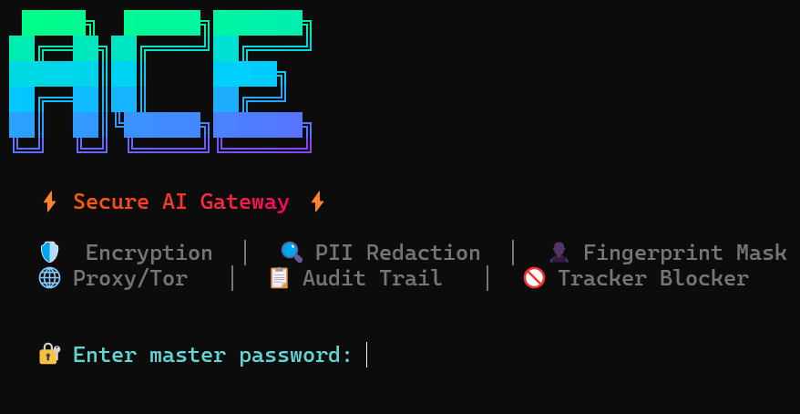

<p align="center">
  
</p>

# 🛡️ ACE CLI

**Security & Anonymity Layer for AI Command Lines**

ACE wraps major AI CLIs (OpenAI, Claude, Gemini, GitHub Copilot, Ollama) with a comprehensive security, privacy, and anonymity layer.

---

## 📦 Installation

### Prerequisites

- **[Node.js](https://nodejs.org) 18+** (LTS recommended)
- **[Git](https://git-scm.com)**
- **npm** (comes with Node.js)

### 🐧 Linux / macOS (Recommended)

```bash
git clone https://github.com/AcerThyRacer/AceCLI.git ~/.acecli && cd ~/.acecli && npm install && npm link
```

Or use the install script:

```bash
curl -fsSLO https://raw.githubusercontent.com/AcerThyRacer/AceCLI/main/install.sh
less install.sh
bash install.sh
```

<details>
<summary>What this does</summary>

1. Clones the repo to `~/.acecli`
2. Installs all dependencies
3. Links the `ace` command globally so you can run it from anywhere

</details>

### 🪟 Windows (One-Liner — PowerShell)

```powershell
git clone https://github.com/AcerThyRacer/AceCLI.git $env:USERPROFILE\.acecli; cd $env:USERPROFILE\.acecli; npm install; npm link
```

Or download and run `install.bat`:

```powershell
# Download and run the installer
Invoke-WebRequest -Uri "https://raw.githubusercontent.com/AcerThyRacer/AceCLI/main/install.bat" -OutFile install.bat
.\install.bat
```

### 🔧 Manual Install (Any OS)

```bash
# 1. Clone the repo
git clone https://github.com/AcerThyRacer/AceCLI.git
cd AceCLI

# 2. Install dependencies
npm install

# 3. Link globally (adds 'ace' to your PATH)
npm link

# 4. Verify it works
ace --help
```

### ♻️ Updating

```bash
cd ~/.acecli   # or wherever you cloned it
git pull
npm install
```

---

## 🚀 Quick Start

```bash
# Launch ACE
ace

# Launch without animation
ace --no-banner

# Run health check
npm run doctor

# Run tests (157 tests)
npm test
```

### First Run Example

```
$ ace

  ╔══════════════════════════════════╗
  ║         🛡️ ACE CLI v1.1.0       ║
  ╚══════════════════════════════════╝

? Set a master password: ********
? Choose a provider: › OpenAI
? Enter your prompt: How does AES encryption work?

  🔍 PII scan: clean
  🛡️ Injection check: passed
  📡 Routing through proxy...

  [AI Response appears here, sanitized in real-time]
```

---

## 🔐 Security Features

| Feature | Description |
|---|---|
| 🔍 **PII Auto-Redaction** | Detects & strips emails, IPs, SSNs, phone numbers, API keys, JWTs, private keys, paths, and more (17 pattern categories) |
| 🛡️ **AES-256-GCM Encryption** | All config, vault, and audit logs encrypted at rest with scrypt key derivation |
| 🌐 **Tor/SOCKS5 Proxy** | Route all AI API traffic through Tor or custom SOCKS proxies |
| 🚫 **Mass Tracker Blocking** | Blocks 1,000+ tracker domains, strips 370+ tracking parameters, sanitizes 90+ tracking headers |
| 👤 **Fingerprint Masking** | Spoofs hostname, username, platform, CPU info to AI providers |
| 📋 **Metadata Stripping** | Removes 60+ sensitive environment variables before subprocess calls |
| ⚠️ **Injection Detection** | Regex + heuristic engine with 8 detection strategies |
| 🔑 **Encrypted API Vault** | Store API keys encrypted, never exposed in plaintext |
| 📝 **Tamper-Proof Audit** | HMAC-SHA-256 chained audit log with integrity verification |
| 📤 **Audit Export** | Export decrypted audit logs as JSON or CSV for compliance |
| ⏱️ **Rate Limiter** | Per-provider sliding-window request throttling |
| 💰 **Cost Tracker** | Token usage & estimated cost per provider |
| 🔒 **Security Profiles** | Paranoid / Balanced / Minimal one-click presets |
| 📦 **Config Export/Import** | Encrypted portable settings backup |
| 🔄 **Session Recovery** | Encrypted checkpoints with auto-save for crash recovery |
| 💀 **Kill Switch** | Instant wipe of all data, keys, logs, clipboard, and recovery |
| 🧹 **Clipboard Auto-Clear** | Cross-platform auto-clear after sensitive operations |
| 🕶️ **Ephemeral Mode** | Zero disk writes, memory-only operation |

---

## 🏗️ Architecture

```
ace (bin entry)
├── src/
│   ├── index.js              Main entry, menus, session lifecycle
│   ├── config.js             Encrypted config & API key vault
│   ├── config-export.js      Config export/import (encrypted backup)
│   ├── conversations.js      Encrypted conversation threads + stats
│   ├── cost-tracker.js       Token usage & cost estimation
│   ├── update-checker.js     Auto-update version checker
│   ├── doctor.js             Health check / diagnostics system
│   ├── errors.js             Typed error classes with recovery advice
│   ├── security/
│   │   ├── sanitizer.js      PII redaction + injection detection
│   │   ├── encryption.js     AES-256-GCM with scrypt KDF
│   │   ├── fingerprint.js    System fingerprint spoofing
│   │   ├── proxy.js          Tor / SOCKS proxy routing + TLS verify
│   │   ├── audit.js          HMAC-chained audit logger + export
│   │   ├── clipboard.js      Cross-platform clipboard (clipboardy)
│   │   ├── recovery.js       Encrypted session checkpoints
│   │   ├── tracker.js        Mass tracker/analytics blocker
│   │   ├── dns.js            DNS-over-HTTPS / DNS-over-TLS
│   │   ├── rate-limiter.js   Per-provider rate limiting
│   │   └── security-profiles.js  Paranoid/Balanced/Minimal presets
│   ├── providers/
│   │   ├── base.js           Base provider + stream sanitizer
│   │   ├── registry.js       Dynamic provider registry
│   │   ├── openai.js         OpenAI CLI wrapper
│   │   ├── claude.js         Claude CLI wrapper
│   │   ├── gemini.js         Gemini CLI wrapper
│   │   ├── copilot.js        GitHub Copilot CLI wrapper
│   │   └── ollama.js         Ollama wrapper
│   ├── plugins/
│   │   └── plugin-manager.js Trusted plugin loader
│   └── ui/
│       ├── banner.js         ASCII art & animation
│       ├── menu.js           Interactive menus
│       └── dashboard.js      Security status dashboard
└── test/
    └── test-all.js           157 unit tests
```

---

## 🤖 Supported AI CLIs

| Provider | CLI Command | Status |
|----------|------------|--------|
| **OpenAI** | `openai` | ✅ Full support |
| **Claude** | `claude` | ✅ Full support |
| **Gemini** | `gemini` | ✅ Full support |
| **GitHub Copilot** | `gh copilot` | ✅ Full support |
| **Ollama** | `ollama` | ✅ Local/Private |

---

## 🔌 Plugin System

Add custom providers via the `PluginManager`:

```js
import { ProviderRegistry } from './src/providers/registry.js';
const registry = new ProviderRegistry();
await registry.loadPlugin('my-provider', './path/to/my-provider.js');
```

Plugins are disabled by default. If enabled, only explicitly trusted plugin filenames with pinned SHA-256 hashes are allowed to load.

---

## ⚙️ Configuration

| File | Location | Description |
|------|----------|-------------|
| Config | `~/.ace/config.enc` | AES-256-GCM encrypted settings |
| API Vault | `~/.ace/vault.enc` | Encrypted API key storage |
| Audit Logs | `~/.ace/audit/` | HMAC-chained, optionally encrypted |
| Recovery | `~/.ace/recovery/` | Encrypted session checkpoints |
| Conversations | `~/.ace/conversations/` | Encrypted chat history |

---

## 🧪 Testing

```bash
# Run all 157 tests
npm test

# Run health check
npm run doctor
```

---

## 📄 License

GPLv3
